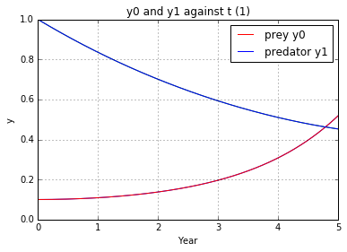
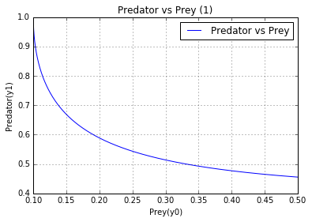

UECM3033 Assignment #3 Report
========================================================

- Prepared by: Lee Hui Zhong
- Tutorial Group: T2

--------------------------------------------------------

## Task 1 --  Gauss-Legendre formula

The reports, codes and supporting documents are to be uploaded to Github at: 

[https://github.com/Huizhonglee/UECM3033_assign3]( https://github.com/Huizhonglee/UECM3033_assign3)

Explain how you implement your `task1.py` here.
In task1, numpy and sympy have as np and sy imported. A function is defined as gausslegendre to implement the Gauss-Legendre quadrature. ¡°np.polynomial.legendre.leggauss(n)¡± is used to compute the weights and nodes for Gauss-Legendre quadrature. Initially, the result for this approximation is set as 0 and number of sample points, n is set as 20.In order to change the interval, x values is translated from [-1,1] to [a,b] by using (b-a)*x*0.5+(a+b)*0.5.Then ,apply it into Gaussian quadrature rule with the equation of sum(w * f(y))*0.5*(b-a).After that, return the result back to the main function.

Explain how you get the weights and nodes used in the Gauss-Legendre quadrature.

Weights and nodes used in the Gauss-Legendre quadrature can be determined by using np.polynomial.legendre.leggauss.

---------------------------------------------------------

## Task 2 -- Predator-prey model

Explain how you implement your `task2.py` here, especially how to use `odeint`.
In task2, numpy, scipy and matplotlib.pyplot have imported as np,sp and plt. Then, a self-defined function has built with the name of g(t,y).In this function, parameter a and b set as 1.0 and 0.2 respectively. After that, return the result of differential equation. Linspace function is used to define the time of 5 years. The system of first order ODE is solved by using sol=sp.integrate.odeint().Graph of y0 and y1 against t and graph of y1 against y0 plotted. To test the sensitivity, graph of y0 and y1 against t and graph of y1 against y0 plotted again by using initial conditions of y0=0.11 and y1=1.0.

Put your graphs here and explain.

From the graph above, we know that the prey(y0) is increasing as the year(t) increase. Then, predator (y1) is decreasing as the year(t) increase. Year(t) is inversely proportional to prey(y0). Then, it is a square relationship between predator(y1) and year(t). 

Graph with initial condition of y0=0.11, y1=1.0

.png)

.png)
	

Is the system of ODE sensitive to initial condition? Explain.
The system of ODE is not sensitive to initial condition. This is because changes on the initial condition with y0=0.1 and y0=0.11 does not affect much which shown in the graph.

-----------------------------------

last modified: 18/4/2016
